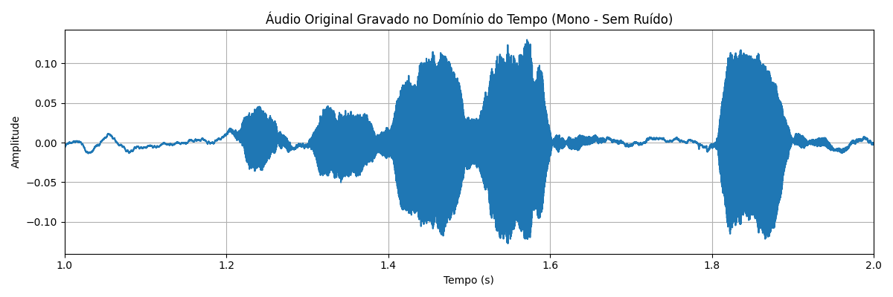
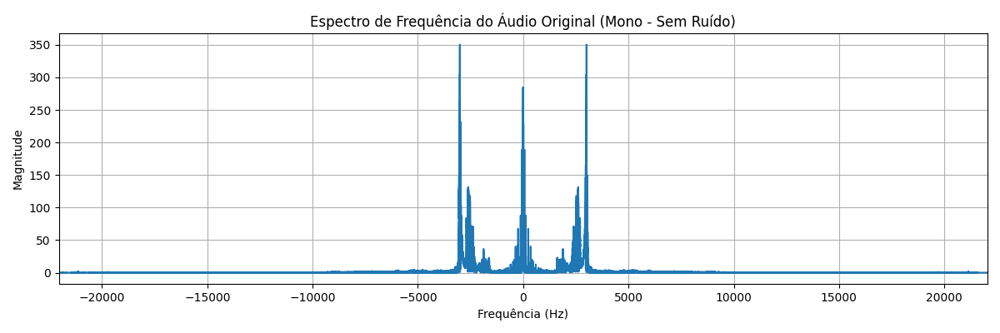
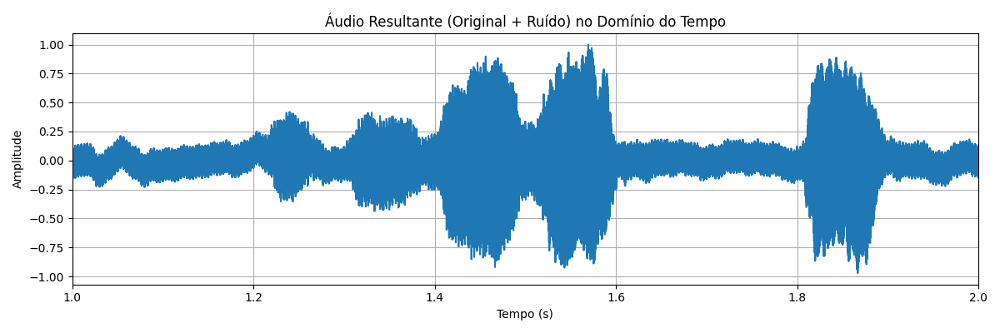
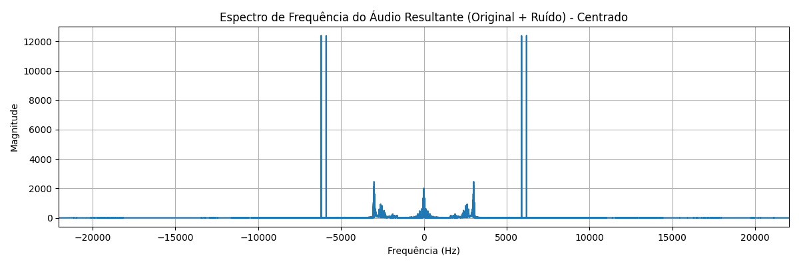
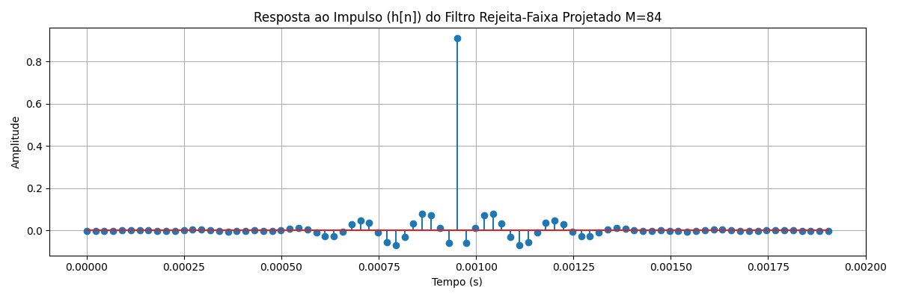
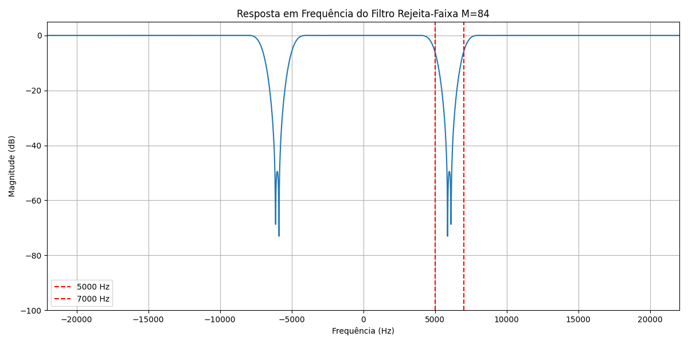
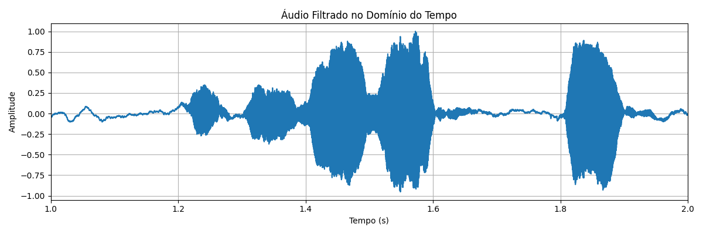
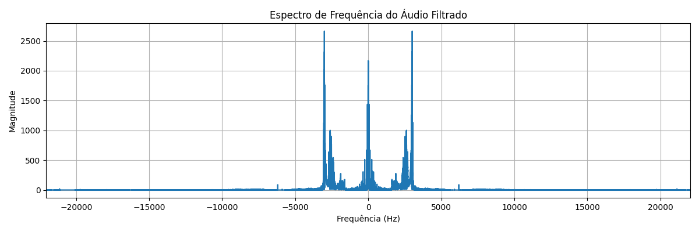

# Estudo de Filtros FIR: Remoção de Ruído em Áudio com Janela de Hamming

Este repositório é um estudo prático sobre **filtros FIR (Resposta Impulsional Finita)**, focando no design e aplicação de um filtro passa-faixa (band-reject) utilizando a **janela de Hamming**. O projeto demonstra o processo de pegar um áudio original, contaminá-lo com um ruído específico e, em seguida, aplicar o filtro FIR projetado para atenuar e remover esse ruído, visualizando os resultados no domínio do tempo e da frequência.

---

## Como Rodar os Códigos

Para executar os scripts e notebooks deste repositório, siga os passos abaixo:

1.  **Python e Pip:** Certifique-se de ter o **Python** (versão 3.x recomendada) e o seu gerenciador de pacotes, **Pip**, instalados em seu sistema.

2.  **Clonar o Repositório:** Abra um terminal ou prompt de comando e clone este repositório para o seu computador:
    ```bash
    git clone [https://github.com/gabriel26077/Filtro-FIR-Parte-III](https://github.com/gabriel26077/Filtro-FIR-Parte-III)
    cd Filtro-FIR-Parte-III
    ```

3.  **Criar um Ambiente Virtual (venv):** É uma boa prática criar um ambiente virtual para isolar as dependências do projeto.
    ```bash
    python -m venv venv
    ```

4.  **Ativar o Ambiente Virtual:**
    * No Windows:
        ```bash
        .\venv\Scripts\activate
        ```
    * No macOS/Linux:
        ```bash
        source venv/bin/activate
        ```

5.  **Instalar as Dependências:** Com o ambiente virtual ativado, instale as bibliotecas necessárias usando o `requirements.txt`. Certifique-se de que este arquivo esteja na raiz do repositório e contenha as dependências listadas (e.g., numpy, matplotlib, scipy, jupyter, sounddevice).
    ```bash
    pip install -r requirements.txt
    ```

6.  **Rodar o Jupyter Notebook:** Com as dependências instaladas, inicie o Jupyter Notebook:
    ```bash
    jupyter notebook
    ```
    Isso abrirá uma nova aba no seu navegador. Navegue até o arquivo **`notebooks/FiltroFIR.ipynb`** do projeto (o notebook principal onde os códigos estão) e execute as células sequencialmente.

---

## Relatório de Gráficos

Os gráficos a seguir ilustram as diferentes etapas do estudo de filtros, mostrando as características do áudio e do filtro nos domínios do tempo e da frequência. Todos os arquivos de imagem estão localizados na pasta `graficos/` do repositório.

### Gráficos do Áudio Original:

* **`audio_original_tempo.png`**: Representação do áudio original no domínio do tempo.
    

* **`audio_original_frequencia.png`**: Espectro de frequência do áudio original em Hertz.
    

### Gráficos do Áudio Contaminado:

* **`audio_contaminado_tempo.png`**: Representação do áudio com ruído no domínio do tempo.
    

* **`audio_contaminado_frequencia.png`**: Espectro de frequência do áudio com ruído em Hertz.
    

### Gráficos do Filtro FIR Projetado:

* **`filtro_tempo.png`**: Resposta ao impulso do filtro no domínio do tempo.
    

* **`filtro_frequencia.png`**: Resposta em frequência do filtro em Hertz.
    

### Gráficos do Áudio Filtrado:

* **`audio_filtrado_tempo.png`**: Representação do áudio após a filtragem no domínio do tempo.
    

* **`audio_filtrado_frequencia.png`**: 
    

## Comparação do original, contaminado e filtrado

### Comparação na frequência

* **`Áudio original na frequência (Hz)`**
    

* **`Áudio contaminado na frequência (Hz)`**
    

* **`Áudio filtrado na frequência (Hz)`**
    


### Comparação no tempo

* **`Áudio original no tempo (Hz)`**
    

* **`Áudio contaminado no tempo`**
    

* **`Áudio filtrado no tempo`**
    
    
